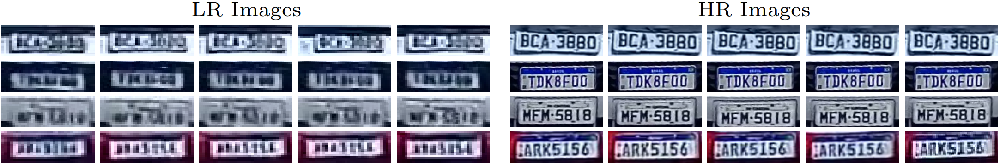
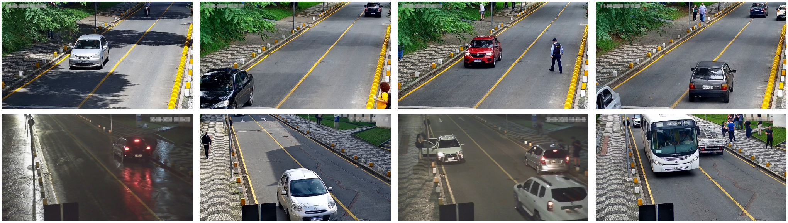

# LRLPR-26 Dataset

The **LRLPR-26** dataset was introduced in the [_ICPR 2026 Competition on Low-Resolution License Plate Recognition_](https://icpr26lrlpr.github.io/) (paper available [here](https://arxiv.org/abs/2604.22506)). It supports research on **low-resolution license plate recognition (LRLPR)** in real surveillance scenarios.

The dataset includes the official competition training and test sets, both released with annotations. It contains **20,000 training tracks** and **3,000 test tracks**. In the training set, each track contains five LR images and five HR images of the same LP, captured at different time steps. In the test set, each track contains only five LR images.

The figure below shows examples of training tracks, with LR images on the left and HR images on the right.

  


## Dataset Organization

| Split | Tracks | Images | Content | Annotations |
|---|---:|---:|---|---|
| Training | 20,000 | 200,000 | 5 LR + 5 HR images per track | LP text, LP layout; corners for Scenario A |
| Test | 3,000 | 15,000 | 5 LR images per track | LP text and LP layout |

The training set is divided into two scenarios:

- **Scenario A:** 10,000 tracks from the previously released [UFPR-SR-Plates](https://github.com/valfride/UFPR-SR-Plates/) dataset, collected under relatively controlled conditions such as daylight and no rain. These tracks include license plate text, layout, and corner annotations;
- **Scenario B:** 10,000 tracks acquired using the same camera as in Scenario A, but facing a different direction. These tracks cover more challenging conditions, including rain and nighttime. They include LP text and LP layout annotations.

The test set contains **3,000 tracks**, with **600 Brazilian** and **2,400 Mercosur** license plates. Each test track corresponds to a unique vehicle, and no test license plate appears in the training set.

Representative images used before license plate detection and extraction are shown below. The top row corresponds to Scenario A, while the bottom row corresponds to Scenario B.



## How to obtain the dataset

The LRLPR-26 dataset is intended exclusively for **academic research** and is made freely available to researchers affiliated with educational or research institutions for **non-commercial use**.

To request access, please read carefully [**this license agreement**](./license-agreement.pdf), fill it out, and send it back to the first author ([rayson@ppgia.pucpr.br](mailto:rayson@ppgia.pucpr.br)). **Your e-mail must be sent from a valid university account** (.edu, .ac or similar).

In general, you will receive a download link within 5 business days. If you do not receive it within this timeframe, please check your spam/junk folder. Failure to follow the instructions above may result in no response.

## Citation

If you use the LRLPR-26 dataset in your research, please cite the competition summary paper:

- R. Laroca, V. Nascimento, D. Kim, S. Chung, S. Bae, U. Seo, S. Oh, C. M. Phung, M. G. Vo, X. Ye, Y. Du, Y. Su, Z. Chen, S. Heo, H. Lee, K. Na, K. V. Vu Nguyen, S. T. Pham, D. N. N. Phung, T. P. Le, V. N. Vo Tran, and D. Menotti, “ICPR 2026 Competition on Low-Resolution License Plate Recognition,” *International Conference on Pattern Recognition (ICPR)*, pp. 1-20, Aug 2026. [[arXiv]](https://arxiv.org/abs/2604.22506)

```bibtex
@inproceedings{laroca2026competition,
  title = {{ICPR} 2026 {C}ompetition on Low-Resolution License Plate Recognition},
  author = {R. {Laroca} and V. {Nascimento} and D. {Kim} and S. {Chung} and S. {Bae} and U. {Seo} and S. {Oh} and C. M. {Phung} and M. G. {Vo} and X. {Ye} and Y. {Du} and Y. {Su} and Z. {Chen} and S. {Heo} and H. {Lee} and K. {Na} and K. V. {Vu Nguyen} and S. T. {Pham} and D. N. N. {Phung} and T. P. {Le} and V. N. {Vo Tran} and D. {Menotti}},
  year = {2026},
  month = {Aug},
  booktitle = {International Conference on Pattern Recognition (ICPR)},
  pages = {1-20},
  doi = {},
  issn = {}
}
```

## Related publications

A list of all our papers on ALPR can be seen [here](https://scholar.google.com/scholar?hl=pt-BR&as_sdt=0%2C5&as_ylo=2018&q=allintitle%3A+plate+OR+license+OR+vehicle+author%3A%22Rayson+Laroca%22&btnG=).

## Contact

Please contact Rayson Laroca ([rayson@ppgia.pucpr.br](mailto:rayson@ppgia.pucpr.br)) with questions or comments.
